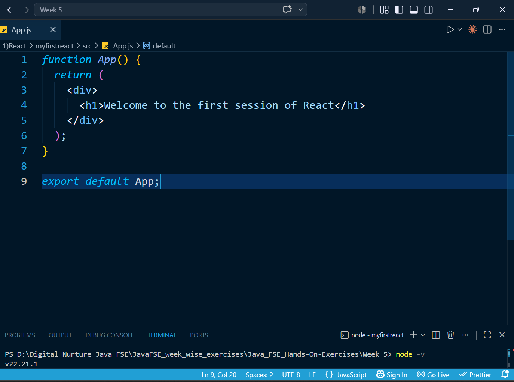
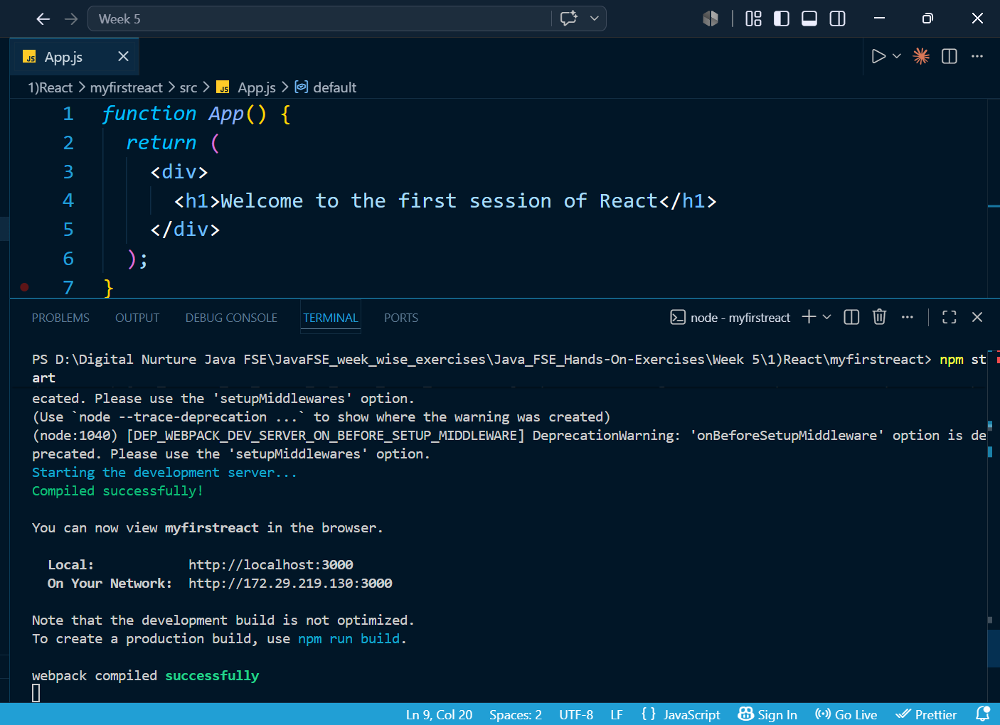
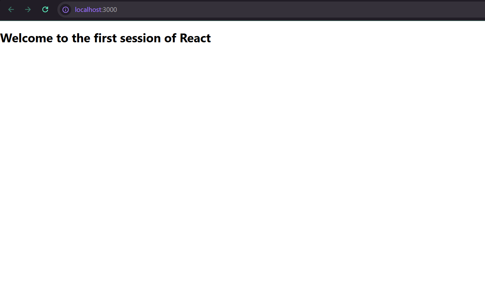

# React Hands-on Exercise 1 - My First React Application

## Introduction

This hands-on exercise focuses on creating and running a simple React application. The project uses **Create React App** to prepare the basic React development environment.

The application renders a welcome message in the browser:

> Welcome to the first session of React

The exercise helps in understanding the basic React project structure and how a functional component displays content on a webpage.

---

## Aim

The main aim of this exercise is to set up a React application and execute it successfully using the React development server.

### Key Goals

- Learn the basic idea of React applications.
- Understand Single Page Applications (SPA).
- Create a new React project.
- Explore the generated React folder structure.
- Modify a React functional component.
- Start the development server using npm.
- View the application output in a browser.

---

## Software Requirements

The following tools are required to complete this exercise:

- Node.js
- npm
- Visual Studio Code
- Web Browser

---

## Tools and Technologies

| Technology | Purpose |
|------------|---------|
| React | Building the user interface |
| JavaScript | Application logic |
| HTML | Webpage content structure |
| CSS | Styling |
| Node.js | JavaScript runtime environment |
| npm | Package and dependency management |
| Create React App | React project setup |

---

## Application Directory Structure

The React project contains the following important files and directories:

```text
myfirstreact/
│
├── public/
│
├── src/
│   ├── App.js
│   ├── App.css
│   ├── index.js
│   └── ...
│
├── package.json
└── README.md
```

The `src` directory contains the main application source code. The `App.js` file is used to define the main React component.

---

## Application Implementation

The default code available in `App.js` was modified to display a simple welcome heading.

```jsx
function App() {
  return (
    <div>
      <h1>Welcome to the first session of React</h1>
    </div>
  );
}

export default App;
```

The `App` functional component returns JSX containing an `<h1>` element. React renders this content in the browser.

---

## Steps to Execute the Application

### Step 1: Clone the Repository

```bash
git clone <repository-url>
```

### Step 2: Open the Project Directory

```bash
cd myfirstreact
```

### Step 3: Download Required Dependencies

```bash
npm install
```

### Step 4: Run the React Development Server

```bash
npm start
```

### Step 5: View the Application

Open a web browser and visit:

```text
http://localhost:3000
```

---

## Application Output

After starting the development server, the application displays:

```text
Welcome to the first session of React
```

This confirms that the React application has been configured and executed successfully.

---

## What I Learned

By completing this hands-on exercise, I learned how to:

- Set up a basic React development environment.
- Generate a React application using Create React App.
- Understand the purpose of important React project files.
- Create and modify a functional component.
- Use JSX to render content.
- Start a React application using npm.
- Test the application output in a browser.

---

## Output Screenshots

The following screenshots demonstrate the implementation and execution of the application:

### App.js Code



### Development Server



### Browser Result



---

## Result

The first React application was created and executed successfully. The exercise demonstrated the basic workflow of setting up a React project, modifying a functional component, and displaying JSX content in the browser.

This project provides a basic foundation for developing more interactive React applications in future exercises.