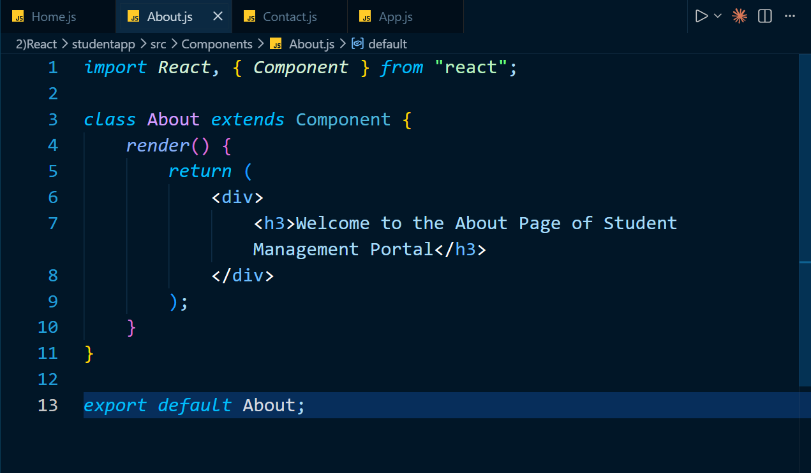
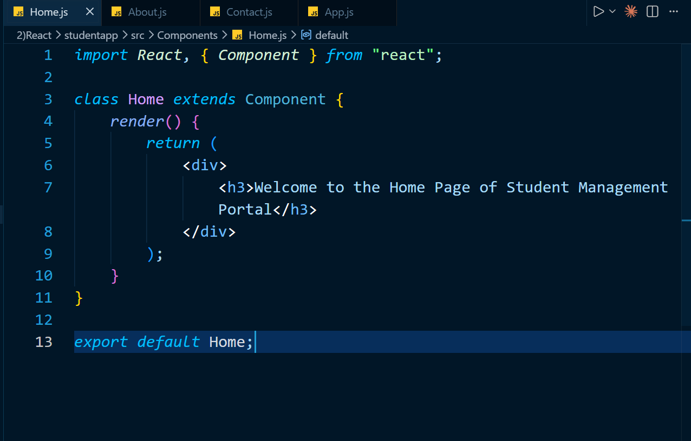
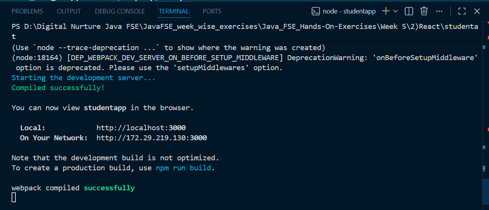

# React Hands-on Exercise 2 - Working with Multiple Class Components

## Introduction

This exercise demonstrates how multiple components can be created and displayed within a React application.

A simple **Student Management Portal** is developed using three React class components: `Home`, `About`, and `Contact`. Each component is maintained in a separate JavaScript file and rendered through the main `App` component.

The exercise highlights React's component-based approach to developing modular user interfaces.

---

## Aim

The aim of this exercise is to understand the creation and usage of **React Class Components** and learn how multiple components can be combined in a single application.

---

## Exercise Goals

The key goals of this hands-on exercise are:

- Understand the basic concept of React components.
- Learn the difference between a JavaScript function and a React component.
- Explore different types of React components.
- Create components using JavaScript classes.
- Understand the role of the `render()` method.
- Import components from different files.
- Display multiple components through the main application component.

---

## System Requirements

Before executing the application, ensure the following software is available:

- Node.js
- npm
- Visual Studio Code
- Web Browser

---

## Technologies and Tools

| Technology | Usage |
|------------|-------|
| React | User interface development |
| JavaScript ES6 | Application programming |
| JSX | Writing UI elements in JavaScript |
| HTML | Content structure |
| CSS | Application styling |
| Node.js | JavaScript runtime |
| npm | Package management |
| Create React App | React project configuration |

---

## Project Directory Structure

The application is organized using a separate directory for React components.

```text
StudentApp/
│
├── public/
│
├── src/
│   ├── Components/
│   │   ├── Home.js
│   │   ├── About.js
│   │   └── Contact.js
│   │
│   ├── App.js
│   ├── App.css
│   ├── index.js
│   └── ...
│
├── package.json
└── README.md
```

The `Components` directory stores the individual class components used by the application.

---

## Component Implementation

Three independent class components are created for the Student Management Portal.

### 1. Home Component

The `Home` component represents the home section of the application.

It displays:

```text
Welcome to the Home Page of Student Management Portal
```

The component uses the `render()` method to return JSX content.

---

### 2. About Component

The `About` component represents the information section of the Student Management Portal.

It displays:

```text
Welcome to the About Page of Student Management Portal
```

---

### 3. Contact Component

The `Contact` component represents the contact section of the application.

It displays:

```text
Welcome to the Contact Page of Student Management Portal
```

---

## Working of the Application

The application follows the steps below:

1. The `Home`, `About`, and `Contact` class components are created in separate JavaScript files.
2. Each class component extends the React `Component` class.
3. The `render()` method returns JSX containing the required welcome message.
4. All three components are imported into `App.js`.
5. The main `App` component renders the three components.
6. React displays the combined component output in the browser.

The component hierarchy can be represented as:

```text
App
│
├── Home
├── About
└── Contact
```

---

## Running the Application

### Step 1: Clone the Repository

```bash
git clone <repository-url>
```

### Step 2: Navigate to the Application Folder

```bash
cd StudentApp
```

### Step 3: Install Project Dependencies

```bash
npm install
```

### Step 4: Start the React Application

```bash
npm start
```

### Step 5: Open the Application

Open a browser and navigate to:

```text
http://localhost:3000
```

The React development server will load the Student Management Portal.

---

## Expected Result

After running the application, the following messages are displayed:

```text
Welcome to the Home Page of Student Management Portal

Welcome to the About Page of Student Management Portal

Welcome to the Contact Page of Student Management Portal
```

The successful display of all three messages confirms that the components have been imported and rendered correctly.

---

## Concepts Practiced

This exercise provides practical experience with:

- React components
- Class-based components
- JSX
- The `render()` method
- Component imports and exports
- Component organization
- Rendering multiple components
- React component hierarchy

---

## Learning Summary

After completing this exercise, I learned how to:

- Create a React class component.
- Extend the React `Component` class.
- Use the `render()` method.
- Return JSX from a component.
- Store components in separate files.
- Import components into the main application.
- Render multiple React components together.
- Organize a React project using a component-based structure.

---

## Implementation Screenshots

### Project Directory Structure


---

### About Component



---

### Contact Component


---

### Main App Component



---

### React Development Server



---

### Browser Output


---

## Result

The Student Management Portal application was successfully developed using multiple React class components.

The exercise demonstrated how independent UI components can be created in separate files and combined through the main `App` component. It also provided a practical understanding of React's modular and component-oriented application structure.