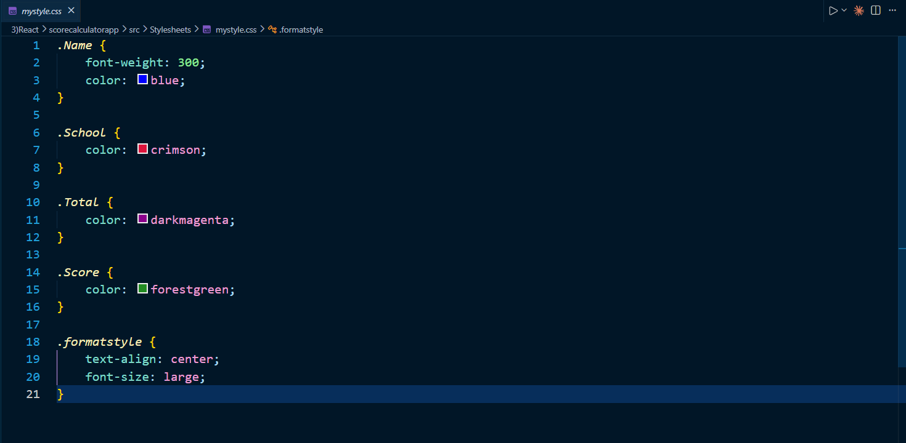

# React Hands-on Exercise 3 - Student Score Calculator Using Props

## Introduction

This exercise focuses on developing a simple **Student Score Calculator** using React.

A functional component is created to receive student details through **props**. The component uses the supplied marks to calculate a percentage score and displays the student information in a styled format.

An external CSS file is also used to keep the presentation separate from the component logic.

---

## Aim of the Exercise

The purpose of this exercise is to understand how React functional components receive data, process values, and display dynamic content.

The application demonstrates the practical use of **props, JSX, calculations, and external CSS styling**.

---

## Key Objectives

The main objectives are:

- Create a functional component in React.
- Understand how props are passed between components.
- Access prop values inside a component.
- Perform a mathematical calculation using received data.
- Display dynamic information using JSX.
- Apply styles through an external CSS file.
- Organize source files into separate component and stylesheet folders.

---

## Required Software

The following tools are required to execute the project:

- Node.js
- npm
- Visual Studio Code
- A modern web browser

---

## Technology Stack

| Tool / Technology | Purpose |
|---|---|
| React | Building the application interface |
| JavaScript ES6 | Component logic and calculations |
| JSX | Creating UI elements |
| CSS | Styling application content |
| HTML | Web content structure |
| Node.js | JavaScript runtime |
| npm | Managing project dependencies |
| Create React App | Initial React project setup |

---

## Project Organization

The project files are arranged as follows:

```text
scorecalculatorapp/
│
├── public/
│
├── src/
│   ├── Components/
│   │   └── CalculateScore.js
│   │
│   ├── Stylesheets/
│   │   └── mystyle.css
│   │
│   ├── App.js
│   ├── App.css
│   ├── index.js
│   └── ...
│
├── package.json
└── README.md
```

The `Components` directory contains the score calculation component, while the `Stylesheets` directory stores the custom CSS file.

---

## Application Functionality

The Student Score Calculator performs the following operations:

1. Receives student information through props.
2. Displays the student's name and school.
3. Receives the total marks obtained.
4. Uses the goal value to calculate the percentage.
5. Formats the calculated score to two decimal places.
6. Displays all information using a styled interface.

---

## CalculateScore Functional Component

The `CalculateScore` component is responsible for processing and displaying the student details.

The following properties are provided to the component:

| Property | Purpose |
|---|---|
| `Name` | Stores the student's name |
| `School` | Stores the school name |
| `total` | Represents marks obtained |
| `goal` | Represents the total number of subjects |

The component receives these values from the main `App` component.

---

## Score Calculation

The percentage score is determined using the following calculation:

```text
Percentage = Total Marks / (Goal × 100) × 100
```

For example:

```text
Total Marks = 284
Goal = 3
```

The calculation becomes:

```text
284 / (3 × 100) × 100
```

Result:

```text
94.67%
```

The final value is formatted to two decimal places before being displayed.

---

## Use of Props

Props are used to transfer student data from the parent component to the `CalculateScore` component.

The component can be rendered from `App.js` with student information similar to:

```jsx
<CalculateScore
  Name="Steeve"
  School="DNV Public School"
  total={284}
  goal={3}
/>
```

This allows the component to receive and display dynamic information.

---

## External CSS Styling

The application uses:

```text
src/Stylesheets/mystyle.css
```

for custom styling.

The stylesheet is used to improve the presentation of:

- Student name
- School information
- Total marks
- Percentage score
- Overall content arrangement

Using a separate stylesheet keeps the user interface styling independent from the component's calculation logic.

---

## Steps to Run the Application

### Step 1: Clone the Project Repository

```bash
git clone <repository-url>
```

### Step 2: Move to the Project Folder

```bash
cd scorecalculatorapp
```

### Step 3: Install Required Packages

```bash
npm install
```

### Step 4: Start the Development Server

```bash
npm start
```

### Step 5: View the Application

Open the following address in a web browser:

```text
http://localhost:3000
```

The React application will automatically load in the browser.

---

## Expected Application Output

The application displays student details similar to the following:

```text
Student Details

Name: Steeve

School: DNV Public School

Total: 284 Marks

Score: 94.67%
```

The displayed score confirms that the component successfully processes the prop values and calculates the percentage.

---

## Concepts Practiced

The following React concepts were practiced during this exercise:

- Functional Components
- React Props
- Parent-to-child data transfer
- JSX
- JavaScript calculations
- Dynamic rendering
- External CSS
- Component organization

---

## Learning Summary

After completing this exercise, I learned how to:

- Develop a React functional component.
- Receive data through props.
- Access prop values within a component.
- Perform calculations using JavaScript.
- Format numerical output.
- Render dynamic student information.
- Apply external CSS styles.
- Separate application logic from presentation.
- Organize React files into meaningful directories.

---

## Implementation Screenshots

### Project Folder Structure


---

### CalculateScore Component


---

### Custom Stylesheet



---

### Main Application Component


---

### React Development Server


---

### Final Browser Output


---

## Result

The Student Score Calculator application was created and executed successfully.

This exercise demonstrated how a React functional component can receive information through props, process numerical data, and dynamically display the calculated result. The use of a separate CSS stylesheet also helped maintain a clear separation between application functionality and visual presentation.

The exercise provided practical experience with reusable components, props, JSX, and modular React application development.