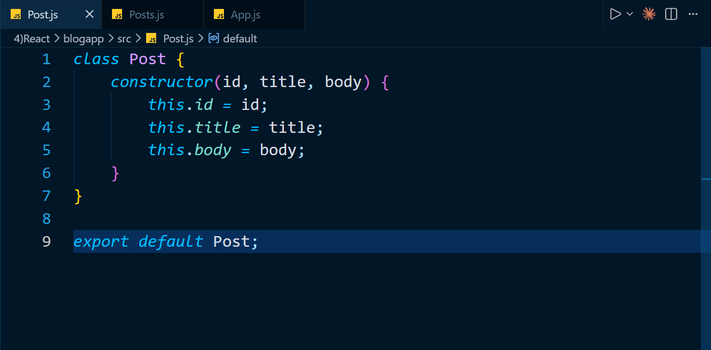

# React Hands-on Exercise 4 - Loading Blog Data Using Lifecycle Methods

## Introduction

This exercise demonstrates how React class components can interact with an external REST API and display dynamically retrieved information.

The application creates a simple **Blog Viewer** that requests post data from the JSONPlaceholder API. The fetched information is stored in component state and rendered as a collection of blog posts.

React lifecycle methods are used to control data loading and handle component-related errors.

---

## Aim

The aim of this exercise is to understand the role of **React Component Lifecycle Methods** and use them while working with asynchronous API requests.

The application mainly demonstrates the use of `componentDidMount()` for retrieving remote data and `componentDidCatch()` for basic error handling.

---

## Exercise Objectives

The main objectives of this hands-on exercise are:

- Understand the lifecycle of a React class component.
- Learn when lifecycle methods are executed.
- Use `componentDidMount()` after component initialization.
- Retrieve information from a REST API.
- Store remote data in React state.
- Dynamically render a collection of objects.
- Understand basic component error handling.
- Practice using `componentDidCatch()`.

---

## Software Requirements

The following software is required to run the application:

- Node.js
- npm
- Visual Studio Code
- Web Browser
- Internet Connection

An internet connection is required because the application retrieves blog information from an external API.

---

## Technologies and Concepts

| Technology / Concept | Purpose |
|---|---|
| React | Creating the application interface |
| JavaScript ES6 | Application logic |
| React Class Components | Component implementation |
| React State | Storing retrieved posts |
| Lifecycle Methods | Controlling component behaviour |
| Fetch API | Sending HTTP requests |
| JSX | Rendering dynamic content |
| CSS | Application styling |
| Node.js | JavaScript runtime |
| npm | Dependency management |

---

## Project Directory Structure

The application follows the structure below:

```text
blogapp/
│
├── public/
│
├── src/
│   ├── App.js
│   ├── App.css
│   ├── Post.js
│   ├── Posts.js
│   ├── index.js
│   └── ...
│
├── package.json
└── README.md
```

### Important Files

- `Post.js` represents an individual blog post.
- `Posts.js` manages API communication and post rendering.
- `App.js` loads the main posts component.
- `index.js` starts the React application.

---

## Application Workflow

The Blog Viewer works using the following sequence:

```text
Application Starts
        ↓
Posts Component is Rendered
        ↓
componentDidMount() Executes
        ↓
loadPosts() is Called
        ↓
Fetch API Sends HTTP Request
        ↓
Blog Data is Received
        ↓
Component State is Updated
        ↓
React Re-renders the Component
        ↓
Blog Posts are Displayed
```

This process demonstrates how React updates the user interface when component state changes.

---

## React Lifecycle Implementation

### componentDidMount()

The `componentDidMount()` lifecycle method executes after the component has been added to the DOM.

In this application, it is responsible for starting the API data-loading process.

The method calls:

```text
loadPosts()
```

The `loadPosts()` method then retrieves blog data from the REST API.

Using `componentDidMount()` prevents the API request from being repeatedly executed during the initial rendering process.

---

### componentDidCatch()

The application also demonstrates the `componentDidCatch()` lifecycle method.

This method is used to respond to errors occurring in descendant components.

When an error is captured, the application can:

- Display an alert message.
- Record error information.
- Print error details in the browser console.

This introduces the basic concept of React error boundaries.

---

## REST API Integration

Blog information is retrieved from the JSONPlaceholder service.

API endpoint:

```text
https://jsonplaceholder.typicode.com/posts
```

The Fetch API sends a request to the endpoint and receives blog data in JSON format.

The general data flow is:

```text
JSONPlaceholder API
        ↓
Fetch Request
        ↓
JSON Response
        ↓
Post Objects
        ↓
React State
        ↓
Browser Interface
```

---

## State Management

The fetched blog posts are stored inside the state of the `Posts` component.

When the API response is received:

1. The JSON response is processed.
2. Blog information is converted into post data.
3. The posts collection is stored in component state.
4. React detects the state update.
5. The component is rendered again with the latest data.

This demonstrates how state controls dynamic information in a React application.

---

## Dynamic Post Rendering

The application displays multiple posts by iterating over the stored post collection.

React's `map()` function is used to process each post.

Each rendered post contains:

- Post title
- Post body

This approach allows the same rendering logic to display multiple API records.

---

## Steps to Run the Project

### Step 1: Clone the Repository

```bash
git clone <repository-url>
```

### Step 2: Navigate to the Project

```bash
cd blogapp
```

### Step 3: Install Application Dependencies

```bash
npm install
```

### Step 4: Start the React Development Server

```bash
npm start
```

### Step 5: Open the Application

Open a web browser and navigate to:

```text
http://localhost:3000
```

The application will retrieve and display blog posts automatically.

---

## Expected Application Behaviour

After the API request completes, a collection of blog posts is displayed.

Example output:

```text
Blog Posts

sunt aut facere repellat provident occaecati excepturi optio reprehenderit

quia et suscipit suscipit recusandae consequuntur expedita...

------------------------------------------------------------

qui est esse

est rerum tempore vitae sequi sint nihil reprehenderit...

------------------------------------------------------------
```

Each section represents a blog post received from the external REST API.

---

## Concepts Practiced

This exercise provides practical experience with:

- React class components
- Component lifecycle
- `componentDidMount()`
- `componentDidCatch()`
- Fetch API
- HTTP requests
- REST API integration
- React state
- Asynchronous data loading
- Dynamic list rendering
- JavaScript `map()`

---

## Learning Summary

After completing this exercise, I learned how to:

- Understand the lifecycle of React class components.
- Execute logic after a component is mounted.
- Retrieve remote data using the Fetch API.
- Process JSON API responses.
- Store fetched information in component state.
- Update the user interface through state changes.
- Dynamically render multiple records.
- Use `map()` to display collections.
- Understand the basic purpose of React error boundaries.

---

## Implementation Screenshots

### Application Project Structure


---

### Post Model Implementation



---

### Posts Component and State


---

### Main App Component


---

### React Development Server


---

### Blog Viewer Output


---

## Result

The Blog Viewer application was successfully created and executed.

The exercise demonstrated how React lifecycle methods can be used with asynchronous API operations. The `componentDidMount()` method was used to initiate blog data retrieval after mounting, while component state was used to store the API response and refresh the interface.

The implementation also introduced basic error handling with `componentDidCatch()` and provided practical experience with REST API integration, Fetch API requests, and dynamic rendering in React.